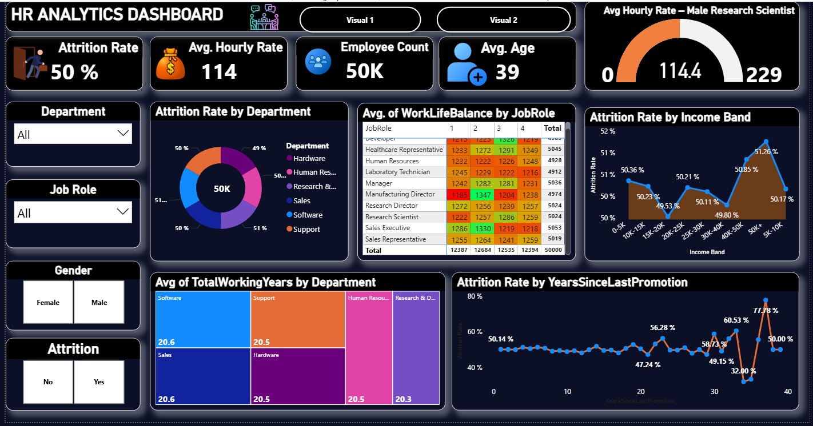

# HR Analytics Dashboard | Power BI

## Project Overview

This project focuses on analyzing employee data to understand
employee attrition, demographics, income, work-life balance,
job roles, departments, and other HR-related KPIs.

An interactive Power BI dashboard was created to help identify
patterns and trends that can support HR decision-making.

## Dashboard Preview

## Objectives

- Analyze overall employee attrition
- Compare attrition across departments
- Analyze attrition by income bands
- Understand employee demographics
- Analyze work-life balance by job role
- Analyze total working years by department
- Study the relationship between promotion history and attrition
- Create interactive HR KPIs and visualizations

## Key KPIs

- Attrition Rate
- Average Hourly Rate
- Employee Count
- Average Age

## Dashboard Features

- Department filter
- Job Role filter
- Gender filter
- Attrition filter
- Department-wise attrition analysis
- Income-band attrition analysis
- Work-life balance analysis
- Years since last promotion analysis
- Total working years analysis

## Tools & Technologies

- Power BI
- Power Query
- DAX
- Microsoft Excel / CSV
- Data Cleaning
- Data Visualization

## Data Preparation

The employee dataset was cleaned and prepared before creating
the dashboard.

The data preparation process included:

- Checking missing values
- Checking duplicate records
- Data type validation
- Data transformation
- Creating calculated measures
- Preparing data for visualization

## Dashboard Insights

Some of the analysis covered in the dashboard includes:

- Overall employee attrition rate
- Attrition differences across departments
- Attrition patterns across income bands
- Work-life balance across different job roles
- Average total working years by department
- Attrition patterns based on years since last promotion

## Project Structure

```text
hr-analytics-powerbi-dashboard/
│
├── README.md
│
├── Dashboard/
│   └── HR_Analytics_Dashboard.pbix
│
├── Data/
│   ├── HR_1.xlsx
│   └── HR_2.xlsx
│
└── Screenshots/
    └── HR_Analytics_Dashboard.png
Author
Gottam Tejashwini
